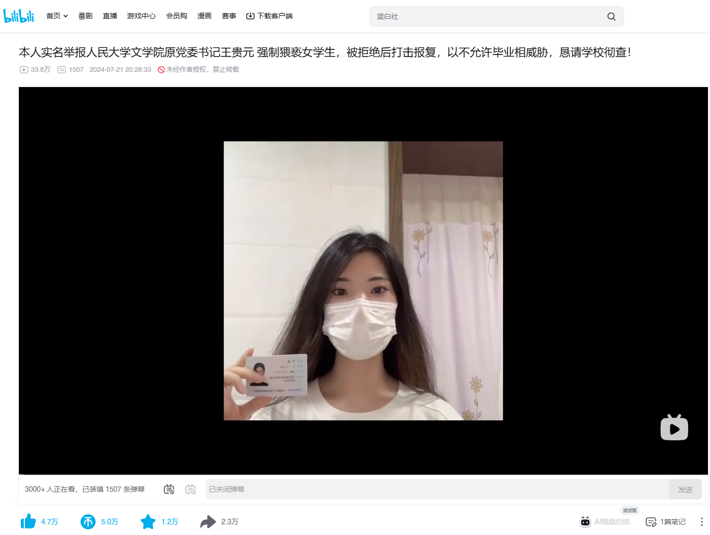
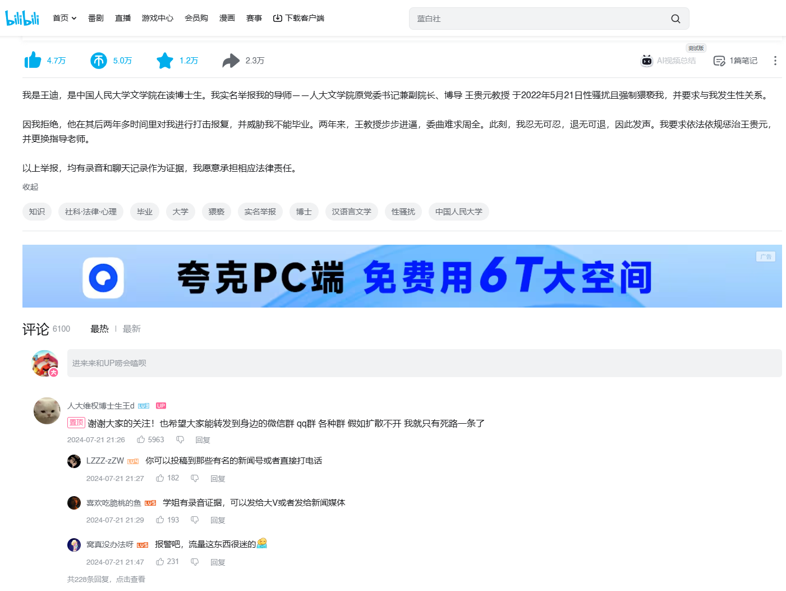

My name is Wang Di, and I’m a PhD student at the School of Liberal Arts at Renmin University of China. I am coming forward to report my advisor, Professor Wang Guiyuan, who was formerly the Party Secretary and Deputy Dean at our school. On May 21, 2022, he sexually harassed and assaulted me, and demanded that I sleep with him.

When I refused, he spent the next two years retaliating against me, even threatening that I wouldn’t be able to graduate. These past two years have been a nightmare, with Professor Wang’s harassment becoming unbearable. I am at my wit’s end and have no choice but to speak out now. I demand that Wang Guiyuan be held accountable and that I be assigned a new advisor.

I have recordings and chat logs to back up my claims, and I am ready to face any legal consequences.

Thank you all for your support! Please help spread the word in your WeChat groups, QQ groups, and anywhere else. If this doesn’t get out, I don’t see any other way out for me.

https://www.bilibili.com/video/BV1CF81evExh/

https://www.youtube.com/watch?v=64Bt4GyafpQ
